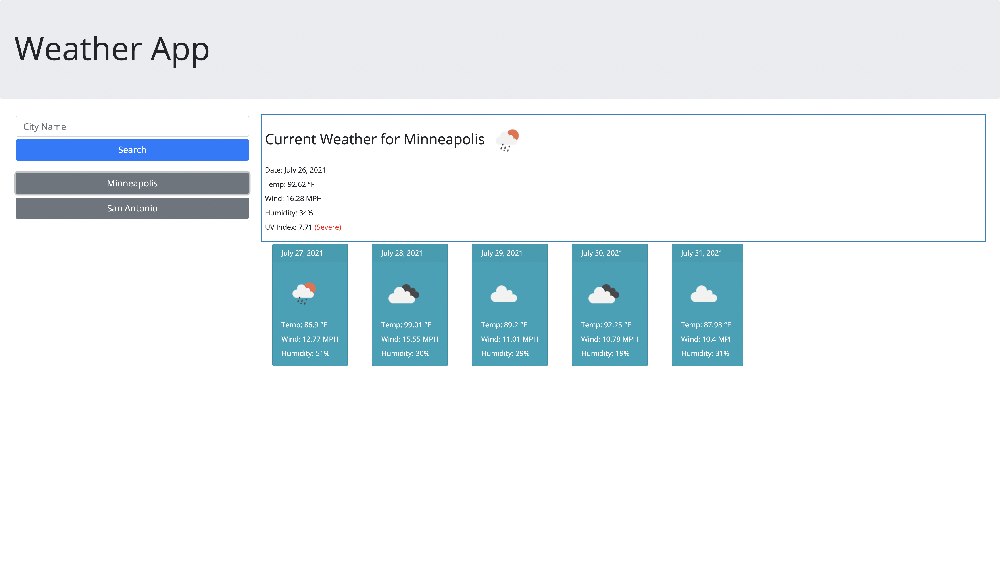

# Weather App

Hello! This project involved using html, css, and javascript as well as the open weather API in order to create a website that allows you to search for the weather for any city in the world. The app uses local storage to save searches, and there are data validation functions in place to ensure you can only search for valid cities. 

